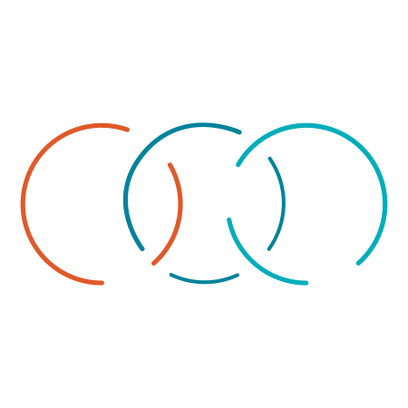
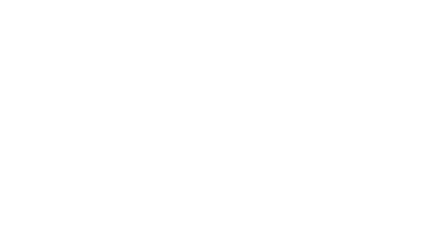

# OpenChain Artwork and Logos

This is where the various images for the OpenChain Project live.

## Using the OpenChain name and logo

These images are under CC-0 licensing.

The OpenChain trademark is managed by [OpenChain project](https://openchain-project). Use of any trademark or logo is subject to the trademark policy available at [linuxfoundation.org/trademarks](https://linuxfoundation.org/trademarks).

Please email [info@openchainproject.org](mailto:info@openchainproject.org) with any questions or requests.

### Color Palette

<table style="text-align:center">
	<tr>
		<th></th>
		<th width="175">RGB</th>
		<th width="175">CMYK</th>
		<th width="175">Pantone</th>
		<th width="175">Hex</th>
	</tr>
	<tr>
		<td></td>
		<td>(0, 173, 187)</td>
		<td>(95, 0, 31, 0)</td>
		<td>Pantone 7466 C</td>
		<td>#00ADBB</td>
	</tr>
	<tr>
		<td></td>
		<td>(0, 130, 134)</td>
		<td>(100, 30, 34, 2)</td>
		<td>Pantone 7712 C</td>
		<td>#008286</td>
	</tr>
	<tr>
		<td></td>
		<td>(225, 88, 41)</td>
		<td>(7, 80, 98, 1)</td>
		<td>Pantone 7579 C</td>
		<td>#E15829</td>
	</tr>
</table>

### Fonts

OpenChain uses the [Josefin Sans](https://fonts.google.com/specimen/Josefin+Sans?preview.text=OPENCHAIN&preview.text_type=custom) font family, freely available under the Open Font License.

### Logos

#### OpenChain

More project logo variants [are available here](./Official/).

<table>
    <tr>
    	<th colspan="7"></th>
    </tr>
    <tr>
        <th></th>
        <th colspan="3">PNG</th>
        <th colspan="3">SVG</th>
    </tr>
    <tr>
        <th></th>
        <th>horizontal</th>
        <th>stacked</th>
        <th>icon</th>
        <th>horizontal</th>
        <th>stacked</th>
        <th>icon</th>
    </tr>
    <tr>
        <th>color</th>
        <td></td>
        <td></td>
        <td></td>
        <td></td>
        <td></td>
        <td></td>
    </tr>
    <tr>
        <th>black</th>
        <td></td>
        <td></td>
        <td></td>
        <td></td>
        <td></td>
        <td></td>
    </tr>
    <tr>
        <th>white</th>
        <td></td>
        <td></td>
        <td></td>
        <td></td>
        <td></td>
        <td></td>
</table>

---

All rights reserved. The Linux Foundation has registered trademarks and uses trademarks. For a list of trademarks of The Linux Foundation, please see our Trademark Usage page: [https://www.linuxfoundation.org/trademark-usage](https://www.linuxfoundation.org/trademark-usage)